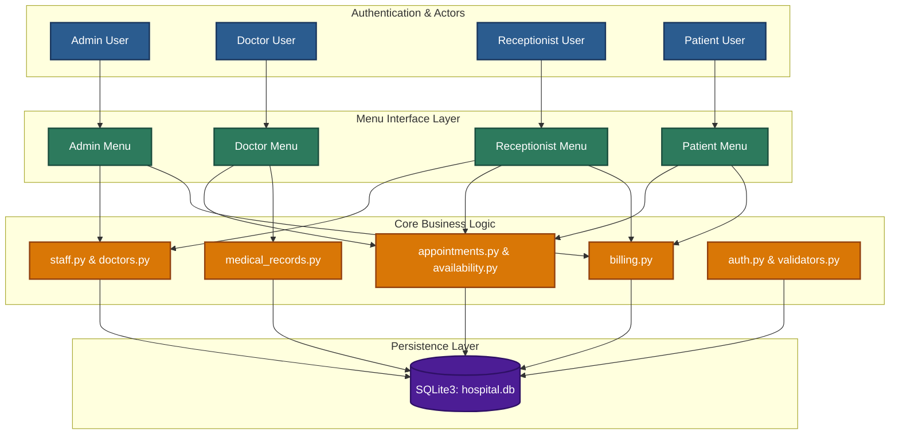
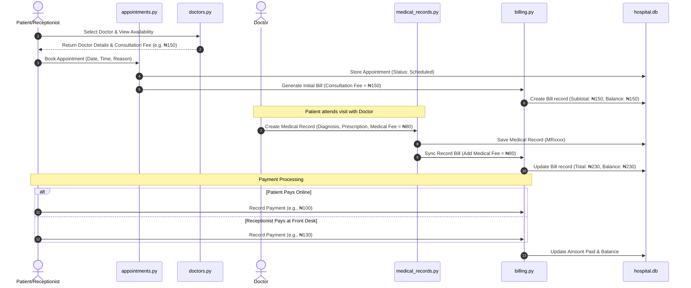

# 🏥 Medicare Community Hospital Management System

> **A Secure, Enterprise-Grade Python Hospital Management & Automated Billing System**


-brightgreen.svg)


The **Medicare Community Hospital Management System** is a robust, modular command-line application built with pure Python. It streamlines hospital workflows across four key roles (**Admin**, **Doctor**, **Receptionist**, and **Patient**), handling everything from smart doctor scheduling and dynamic consultation fees to automated medical billing and strict patient privacy controls.

---

## 🌟 Key Highlights & Professional Rebuild Features

- 💲 **Dynamic Doctor Consultation Fees**: Administrators configure unique consultation fees per doctor (varying by specialization). Consultation fees are automatically fetched during appointment booking and clearly presented as a notice—neither patients nor receptionists dictate the fee.
- 🩺 **Integrated Medical Record Billing**: When a doctor creates a medical record with clinical notes, prescriptions, and treatment fees, the system automatically generates or updates the patient's bill combining the **Doctor's Consultation Fee** and **Medical Charges**.
- 🔒 **Patient Privacy & Access Control**: Enforces strict HIPAA-aligned access control. Doctors can **only** view the medical history of patients who have active or past appointments/visits with them. Unauthorized access attempts are blocked immediately.
- 💳 **Flexible Dual-Channel Payments**: Outstanding balances reflect instantly at the front desk and on the patient portal upon login. Payments can be processed by patients online or by receptionists at the front desk.
- 📊 **Smart 7-Day Doctor Availability**: Real-time slot management prevents double-booking and presents patients with available 30-minute time slots over a 7-day rolling window.
- 🧪 **Automated Test Suite**: Comes with a full unit test suite (`test_system.py`) validating doctor fee management, booking automation, billing math, access controls, and payment processing.
- 🔄 **Idempotent Data Persistence & Auto-Migrations**: Data persists in SQLite (`hospital.db`). Database tables and missing columns auto-migrate seamlessly without data loss.

---

## 🎨 System Architecture & Workflow Diagrams

### 1. High-Level System Architecture



---

### 2. End-to-End Medical Visit & Billing Workflow



---

## 🔑 Default Seed Credentials

Upon first launch, the system automatically seeds administrative and default staff accounts into `hospital.db`:

### System Administrator
- **Username**: `s23rez`
- **Password**: `M3dicar3`

### Pre-Seeded Staff (Single-Factor Pass Code Login)

| Role | Pass Code | Staff Name | Specialization | Consultation Fee |
|:---|:---|:---|:---|:---|
| **Doctor** | `Doc001` | Dr. Diego Suarez | Cardiology | ₦150.00 |
| **Doctor** | `Doc002` | Dr. Amara Chen | Pediatrics | ₦80.00 |
| **Doctor** | `Doc003` | Dr. Michael Okafor | General Medicine | ₦50.00 |
| **Doctor** | `Doc004` | Dr. Elena Petrova | Dermatology | ₦100.00 |
| **Doctor** | `Doc005` | Dr. Samuel Whitfield | Dentistry | ₦120.00 |
| **Receptionist** | `Rec001` | Grace Adeyemi | Front Desk | — |
| **Receptionist** | `Rec002` | Tunde Bakare | Front Desk | — |

---

## 🛡️ Role & Access Control Matrix

| Feature / Action | Admin | Doctor | Receptionist | Patient |
|:---|:---:|:---:|:---:|:---:|
| **Self-Registration** | ❌ | ❌ | ❌ | ✅ |
| **Manage Staff & Issue Pass Codes** | ✅ | ❌ | ❌ | ❌ |
| **Set & Update Doctor Consultation Fees** | ✅ | ❌ | ❌ | ❌ |
| **Book & Reschedule Appointments** | ✅ | ❌ | ✅ | ✅ |
| **View Own Doctor Schedule** | — | ✅ | — | — |
| **View Medical History (Assigned Patients)** | ✅ | ✅ | ❌ | ✅ (Own) |
| **View Medical History (Unassigned Patients)**| ✅ | ❌ (Blocked) | ❌ | ❌ |
| **Create & Edit Medical Records** | ❌ | ✅ (Own Records) | ❌ | ❌ |
| **Add Medical / Treatment Fees to Bill** | ❌ | ✅ | ❌ | ❌ |
| **Process Bill Payments** | ✅ | ❌ | ✅ | ✅ (Own) |
| **Generate Hospital Revenue Reports** | ✅ | ❌ | ❌ | ❌ |

---

## 📂 Project Directory Structure

```text
hospital_system/
├── main.py                 # Entry point: welcome screen, sign-up/login, role router
├── db.py                   # SQLite connection, schema definition & auto-migrations
├── auth.py                 # PBKDF2-HMAC-SHA256 password hashing & staff pass logic
├── validators.py           # Input regex validation (email, phone, dates, age calculation)
├── patients.py              # Patient registration, search, and profile lookup
├── doctors.py               # Doctor profile management & consultation fee logic
├── availability.py          # 7-day rolling slot availability calculator
├── receptionists.py         # Receptionist profile management
├── staff.py                 # Staff profile & pass code integration wrapper
├── seed.py                  # Idempotent default account bootstrapper
├── appointments.py          # Appointment booking, conflict detection & rescheduling
├── medical_records.py       # Clinical record creation, updates & privacy access control
├── billing.py                # Financial calculation, bill generation & payment processing
├── reports.py                 # Text-based hospital analytical reports generator
├── test_system.py           # Automated unit test suite (unittest)
├── ui.py                     # CLI UI formatting, tables, prompts & headers
├── menus/
│   ├── admin_menu.py        # Administrator control portal
│   ├── receptionist_menu.py # Front-desk operations portal
│   ├── doctor_menu.py       # Clinical operations portal
│   ├── patient_menu.py      # Patient self-service portal
│   └── reports_menu.py      # Shared analytical reports sub-menu
└── reports/                 # Output folder for generated text reports
```

---

## 🚀 Getting Started

### Prerequisites
- **Python 3.8+** (No external `pip` dependencies required).

### Installation & Execution
1. Open your terminal and navigate to the project directory:
   ```bash
   cd hospital_system
   ```
2. Launch the application:
   ```bash
   python main.py
   # or on Windows:
   python3 main.py
   ```

### Running the Automated Test Suite
To execute the automated unit test suite and verify system integrity:
```bash
python -m unittest test_system.py
```

---

## 🧪 Technical & Implementation Details

- **Security & Hashing**: All passwords and Pass codes are salted and hashed using standard library `hashlib.pbkdf2_hmac` (`sha256`, 100,000 iterations). Plaintext credentials are never saved.
- **Precision Currency Math**: Uses `math.floor(amount * 100 + 0.5) / 100` in `billing.py` to ensure exact banker's rounding to 2 decimal places without floating-point representation anomalies.
- **Automated Schema Migrations**: `db.init_db()` inspects SQLite PRAGMA table columns on startup and executes `ALTER TABLE` statements automatically if new columns (`consultation_fee`, `medical_fee`, `record_id`) are missing.
- **Conflict Prevention**: `appointments.py` runs atomic conflict checks (`_check_conflict`) on doctor schedule slots prior to committing appointments.

---

## 📝 License & Attribution

Built for Medicare Community Hospital. Designed and developed with pure Python standard library principles for maximum portability, security, and performance.
